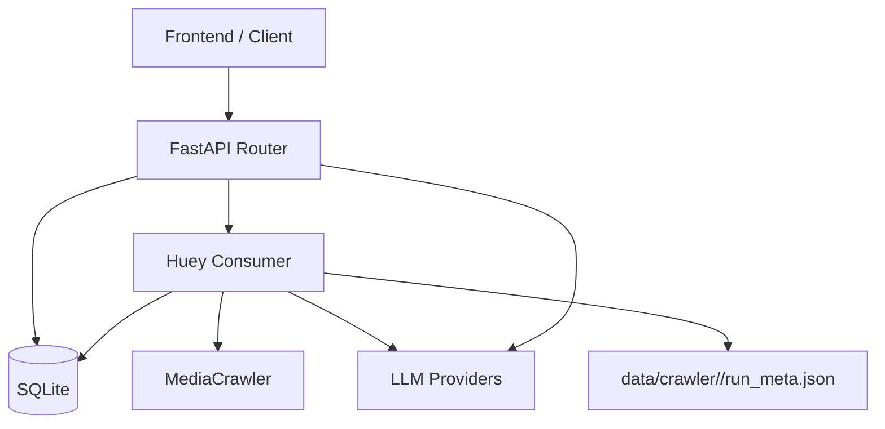

<p align="center">
  
</p>

<p align="center">
  
</p>

<p align="center">
  
  
  
  
  
  
</p>

<p align="center">
  
</p>

<p align="center">
  <strong>证据优先的决策推演后端</strong>
  <br />
  <strong>An evidence-first backend for complex decision analysis</strong>
</p>

Wolong Backend 不是传统的“提问-回答”接口，而是一条围绕复杂决策建立的分析链路：先采集外部信息，再提炼事实、审查偏差、构建因果沙盘、注入用户变量，最后生成世界线与行动白皮书。

Wolong Backend is not a plain Q&A API. It is a full inference pipeline for complex decisions: collect external signals, extract auditable facts, inspect bias, build a causal sandbox, inject verified user context, then simulate worldlines and generate a decision whitepaper.

## Product Snapshot | 产品速览

| 中文 | English |
| --- | --- |
| 面向高不确定决策的分析后端 | Backend for high-uncertainty decision analysis |
| 把“感觉”拆成“证据、变量、因果、路径” | Turns intuition into evidence, variables, causality, and paths |
| 支持真实平台采集、LLM 分阶段推演、异步后台任务 | Supports real-platform crawling, staged LLM inference, and async workers |
| 可做职业转型、投入判断、路径选择、机会成本分析 | Useful for career transitions, strategic bets, path selection, and opportunity-cost analysis |

## Why It Exists | 为什么做这个项目

很多决策工具的问题不在于“模型不够强”，而在于流程太短：

- 用户只得到一个结论，没有证据链。
- 事实、情绪、偏见和猜测混在一起。
- 没有变量注入，推演只能停留在泛化建议。
- 没有可复查的中间层，前端很难做成完整产品。

This project exists because many decision tools collapse too early:

- they return conclusions without evidence,
- they mix facts with emotion and bias,
- they skip user-state injection,
- and they expose too little structure for a real product experience.

Wolong 的思路是把推演过程拆开，让每一层都可存储、可追踪、可复查。

## End-to-End Flow | 全链路流程


## Core Capabilities | 核心能力

| Module | 中文说明 | English |
| --- | --- | --- |
| Case | 创建、追踪、删除案例 | Create, track, and delete decision cases |
| Search Strategy | 根据背景生成检索关键词 | Generate search keywords from user context |
| Collection | 触发异步采集并记录进度 | Run async collection with progress tracking |
| Fact Audit | 从证据中提炼可审阅事实卡 | Extract auditable facts from evidence |
| Audit Elements | 聚合事实为核心系统元素 | Aggregate facts into core system elements |
| Sandbox | 生成因果图并执行干预推演 | Build causal graphs and run interventions |
| Context | 注入用户真实状态与约束 | Inject verified user state and constraints |
| Worldline | 推演多条可能演化路径 | Simulate possible future paths |
| Whitepaper | 输出主要矛盾、风险与行动建议 | Produce conflict, risk, and action summaries |
| Feedback | 接收事实级与案例级反馈 | Collect fact-level and case-level feedback |

## Architecture | 架构视图



## Repo Layout | 目录结构

```text
./
├── app/
│   ├── api/            # Routes and request-level config parsing
│   ├── core/           # Config, prompts, unified responses
│   ├── db/             # Database setup and initialization
│   ├── models/         # SQLAlchemy entities
│   ├── schemas/        # Pydantic DTOs
│   ├── services/       # crawler / llm / simulation
│   └── workers/        # Huey queue and background jobs
├── data/               # SQLite / Huey / crawler runtime artifacts
├── tests/              # Route-level flow tests
├── debug_llm.py
├── patch_db.py
└── requirements.txt
```

## Quick Start | 快速开始

### 1. Install Dependencies | 安装依赖

```bash
python3 -m pip install -r requirements.txt
```

### 2. Prepare MediaCrawler If Needed | 如需真实采集，准备 MediaCrawler

如果你希望启用真实平台采集，需要本地准备 `MediaCrawler` 仓库，并通过环境变量指向它。

If you want real platform crawling, prepare a local `MediaCrawler` repo and point the backend to it.

```bash
export CRAWLER_REPO_PATH=/path/to/MediaCrawler
```

如需单独安装 MediaCrawler 依赖：

```bash
cd /path/to/MediaCrawler
python3 -m pip install -r requirements.txt
```

### 3. Configure Runtime Env | 配置运行环境

```bash
export CRAWLER_REPO_PATH=/path/to/MediaCrawler
export CRAWLER_PLATFORMS=xhs,zhihu
export CRAWLER_LOGIN_TYPE=qrcode
export CRAWLER_HEADLESS=false
export CRAWLER_ENABLED=true
```

### 4. Start API | 启动 API

```bash
uvicorn app.main:app --reload --host 0.0.0.0 --port 8000
```

### 5. Start Worker | 启动后台任务消费者

```bash
huey_consumer app.workers.worker.huey
```

### 6. Health Check | 健康检查

```bash
curl http://127.0.0.1:8000/health
```

Expected response:

```json
{"status": "ok"}
```

## Demo Mode | 本地演示模式

如果你只想先联调接口，而不接真实爬虫，可以关闭采集开关，并且不要传入 `X-Wolong-Config` 的 provider 配置。

If you only want to wire up the API without real crawling, disable crawler execution and skip provider injection in `X-Wolong-Config`.

```bash
export CRAWLER_ENABLED=false
```

此时仍可完成：

- 创建案例 / create cases
- 启动采集任务 / start collection tasks
- 写入基础证据与事实占位 / generate fallback evidence and facts
- 生成启发式沙盘结构 / build heuristic sandbox output
- 跑通大部分前端联调 / support most frontend integration flows

说明：`worldline` 和 `whitepaper` 的真实生成仍依赖已配置的阶段模型与必要上下文。

## Runtime Config | 运行配置

| Variable | Default | 说明 / Meaning |
| --- | --- | --- |
| `APP_DB_PATH` | `data/app.db` | 主业务 SQLite 路径 / main SQLite path |
| `HUEY_DB_PATH` | `data/huey.db` | Huey 存储路径 / Huey storage path |
| `OPENAI_API_KEY` | empty | 预留默认模型配置，主链路不直接用它做阶段分配 / reserved default key |
| `OPENAI_BASE_URL` | empty | 预留默认网关配置，推荐通过 `X-Wolong-Config` 注入 / reserved default base URL |
| `OPENAI_MODEL` | `gpt-4o-mini` | 预留默认模型名，推荐通过请求头指定 / reserved default model |
| `LLM_ENABLED` | `true` | 预留开关，主流程实际以 provider 配置为准 / reserved switch |
| `CRAWLER_REPO_PATH` | `../external/MediaCrawler` | MediaCrawler 本地路径 / local crawler repo path |
| `CRAWLER_PLATFORMS` | `xhs,zhihu` | 默认平台 / default platforms |
| `CRAWLER_LOGIN_TYPE` | `qrcode` | 登录方式 / login type |
| `CRAWLER_HEADLESS` | `false` | 是否无头 / headless mode |
| `CRAWLER_GET_COMMENT` | `true` | 是否抓评论 / fetch comments |
| `CRAWLER_MAX_NOTES` | `30` | 每平台默认帖子数 / default posts per platform |
| `CRAWLER_CONCURRENCY` | `1` | crawler 并发数 / crawler concurrency |
| `CRAWLER_ENABLED` | `true` | 是否启用真实采集 / enable real crawling |

## Request-Level Provider Injection | 按请求注入模型与采集配置

当前代码里，真正驱动 LLM 阶段的是 `X-Wolong-Config` 请求头。

In the current codebase, `X-Wolong-Config` is the primary runtime entry for staged LLM providers and per-request crawling configuration.

该请求头内容是一个 Base64 编码 JSON，结构如下：

```json
{
  "providers": [
    {
      "id": "openai-main",
      "name": "OpenAI",
      "baseUrl": "https://api.openai.com/v1",
      "apiKey": "sk-***",
      "defaultModel": "gpt-4o-mini"
    }
  ],
  "stageAssignments": {
    "collection": "openai-main",
    "audit": "openai-main",
    "sandbox": "openai-main",
    "worldline": "openai-main"
  },
  "crawlerPlatforms": [
    {
      "name": "xhs",
      "max_notes": 30,
      "get_comments": true,
      "max_comments_count_singlenotes": 10
    },
    {
      "name": "zhihu",
      "max_notes": 20,
      "get_comments": false,
      "max_comments_count_singlenotes": 10
    }
  ],
  "extraction": {
    "chunk_size": 12,
    "chunk_overlap": 0,
    "max_chunk_tokens": 0
  }
}
```

这意味着前端可以做到：

- 单次请求切换不同模型 / swap providers per request
- 按案例调整平台与抓取预算 / tune platform budgets case by case
- 调整事实提炼的切块策略 / tune extraction chunk strategy
- 不依赖服务端静态写死的 provider / avoid server-side hardcoded provider binding

## API Map | 接口地图

### Base | 基础接口

| Method | Path | Description |
| --- | --- | --- |
| `GET` | `/health` | Health check |
| `POST` | `/llm/test` | Test the assigned provider |

### Case Lifecycle | 案例生命周期

| Method | Path | Description |
| --- | --- | --- |
| `POST` | `/cases` | Create a case |
| `GET` | `/cases/history` | List historical cases |
| `DELETE` | `/cases/{case_id}` | Delete a case and its artifacts |

### Collection & Facts | 采集与事实层

| Method | Path | Description |
| --- | --- | --- |
| `POST` | `/cases/{case_id}/search-strategy` | Generate search strategy |
| `POST` | `/cases/{case_id}/start-collection` | Start background collection |
| `GET` | `/cases/{case_id}/collection-status` | Query collection and extraction status |
| `GET` | `/cases/{case_id}/facts` | Get fact cards |
| `GET` | `/cases/{case_id}/audit-elements` | Get audit element cards |
| `GET` | `/cases/{case_id}/evidences` | Get evidence items, optional ID filter |
| `POST` | `/cases/{case_id}/facts/{fact_id}/feedback` | Submit fact-level feedback |

### Causal Sandbox | 因果沙盘

| Method | Path | Description |
| --- | --- | --- |
| `GET` | `/cases/{case_id}/sandbox` | Get or generate sandbox graph |
| `POST` | `/cases/{case_id}/sandbox/regenerate` | Regenerate sandbox graph |
| `POST` | `/cases/{case_id}/sandbox/intervene` | Apply intervention and simulate effects |

### Worldline & Whitepaper | 世界线与白皮书

| Method | Path | Description |
| --- | --- | --- |
| `GET` | `/cases/{case_id}/worldline/probe` | Generate variable probe questions |
| `PUT` | `/cases/{case_id}/context` | Inject verified user context |
| `GET` | `/cases/{case_id}/worldline` | Get or generate worldline |
| `POST` | `/cases/{case_id}/worldline/regenerate` | Regenerate worldline |
| `POST` | `/cases/{case_id}/worldline/intervene` | Run worldline intervention |
| `GET` | `/cases/{case_id}/whitepaper` | Get or generate whitepaper |
| `POST` | `/cases/{case_id}/feedbacks` | Submit case-level feedback |

## Response Shape | 返回结构

Success:

```json
{
  "code": 200,
  "message": "success",
  "data": {}
}
```

Error:

```json
{
  "code": 40000,
  "message": "error message"
}
```

说明：部分接口会省略 `message` 或 `data`，以符合当前路由实现。

## Data Artifacts | 数据落地

运行后主要会产生以下文件：

- `data/app.db`：业务数据库
- `data/huey.db`：任务数据库
- `data/crawler/<case_id>/`：案例级 crawler 输出
- `data/crawler/<case_id>/run_meta.json`：采集参数、步进统计、模型元信息

`run_meta.json` 尤其重要，因为它可以为前端提供：

- 平台与关键词请求参数
- 每个平台每个关键词的执行步进
- 抓取、过滤、证据、事实数量统计
- 沙盘、世界线、白皮书的模型元信息

## Testing | 测试

```bash
pytest -q
```

当前测试重点是路由级链路闭环，覆盖：

- 创建案例 / case creation
- 搜索策略生成 / strategy generation
- 采集启动与状态查询 / collection lifecycle
- 事实与证据读取 / fact and evidence retrieval
- 沙盘干预 / sandbox intervention
- 上下文注入 / context injection
- 案例反馈 / case feedback

测试文件：`tests/test_cycle_routes.py`

## Frontend Integration | 前端联调

如果前端单独部署，至少确认两点：

- Axios `baseURL` 指向 `http://localhost:8000`
- 关闭本地 mock 初始化逻辑，避免和真实接口重叠

## Current Boundaries | 当前边界

### Implemented | 已具备

- 完整案例生命周期 API
- Huey 异步任务与进度查询
- 可接 MediaCrawler 的真实内容采集
- 按阶段动态配置模型
- 因果沙盘、世界线、白皮书链路
- 无模型或无爬虫情况下的基础降级策略

### Still Worth Adding | 建议后续补强

- 鉴权与权限控制
- 任务取消、重试与死信处理
- 更细粒度的日志与观测
- 容器化部署与环境模板
- 更完整的 API 示例与 SDK 封装

## Closing Line | 收束一句

Wolong Backend 关注的不是“直接给答案”，而是把复杂决策拆成一个可复盘、可追踪、可交互的推演过程。

Wolong Backend is designed not to answer too early, but to turn complex decisions into a traceable, reviewable, and product-ready inference process.
